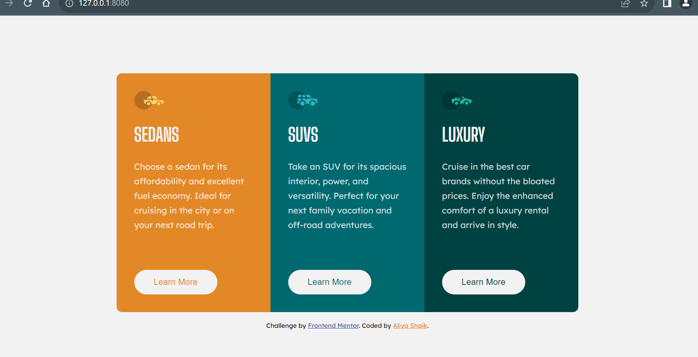

# Frontend Mentor - 3-column preview card component solution

This is a solution to the [3-column preview card component challenge on Frontend Mentor](https://www.frontendmentor.io/challenges/3column-preview-card-component-pH92eAR2-). Frontend Mentor challenges help you improve your coding skills by building realistic projects.

## Table of contents

- [Overview](#overview)
  - [Screenshot](#screenshot)
  - [Links](#links)
  - [Built with](#built-with)
  - [What I learned](#what-i-learned)
  - [Continued development](#continued-development)
- [Author](#author)
- [Acknowledgments](#acknowledgments)

## Overview

This is the challenge of 3-column preview card component from FrontenMentor ,I have done and by the way nice challenge:D

### Screenshot



Active-State


### Links

- Solution URL: [Add solution URL here](http://127.0.0.1:8080/index.html)
- Live Site URL: [Add live site URL here](https://your-live-site-url.com)

## My process

### Built with

- Semantic HTML5 markup
- CSS custom properties
- Flexbox
- CSS Grid

### What I learned

-I have learned how button hover and focus states changes using CSS its quite nice ,here i'm using "box-shadow" property infact there r so many ways for doing this button hover states but I have done this way:D

-Another property also used quite nicely "overflow:hidden" ,when i'm setting border-radius to whole container its not reflect when i have set this "overflow" property then its nicely work ,if any struggle for doing this you can see my code snippets:D

```css
.btn-1:hover,
.btn-1:focus {
  box-shadow: inset 0 0 0 2px var(--primary-white-all);
}
.container {
  overflow: hidden;
  border-radius: 0.6rem;
}
```

### Continued development

-Yes i'm really want to learn perfect from basic's to advance of HTML,CSS and Javascript,
-I'm shure with help of "FrontendMentor" i will learn all above mentioned in future projects.
-I want to focus on Javascript logics and HTML/CSS coding as well

## Author

- Website - [Aliya Shaik](http://127.0.0.1:8080/index.html)
- Frontend Mentor - [@SkAliya](https://www.frontendmentor.io/profile/SkAliya)

## Acknowledgments

#I have completed this challenge by Myself. Thanks to Frontend Mentor community.
